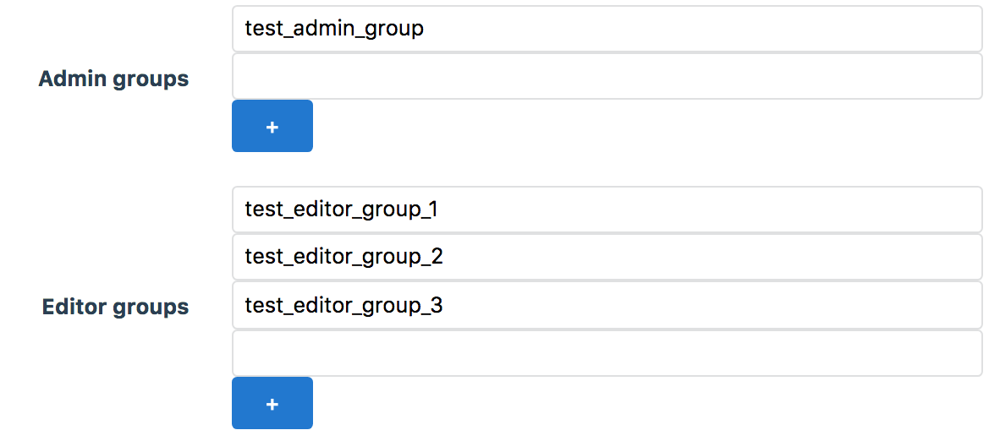

# Administrate::Field::List

simple plugin in order to be able to view and edit serialized list within Administrate



supported serialization type
- JSON

```ruby
class Project < ApplicationRecord
  serialize :admin_group, JSON
  serialize :editor_group, JSON
```

## Installation

Add this line to your application's Gemfile:

```ruby
gem 'administrate-field-list'
```

And then execute:

    $ bundle install

## Usage

In your Dashboard `ATTRIBUTE_TYPES` use the field type `Field::List`. i.e.
```ruby
ATTRIBUTE_TYPES = {
  tags: Field::List
}
```

## Contributing

Bug reports and pull requests are welcome on GitHub at https://github.com/potato2003/administrate-field-list
